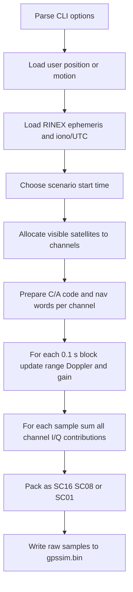

# `gpssim.c` Walkthrough: From Input to `gpssim.bin`

This note explains, step by step, how `gps-sdr-sim` turns user input, scenario time, and RINEX ephemeris data into a raw binary file of GPS L1 C/A baseband samples.

The focus here is the execution path in `gpssim.c`, not GPS theory in the abstract.

## What The Program Produces

`gpssim.bin` is **not** a decoded GPS message file and it is **not** RF at 1575.42 MHz.

It is a stream of **complex baseband I/Q samples**. Each sample pair represents the sum of all simulated satellites at one instant in time:

```text
s[n] = sum over satellites {
  gain * nav_bit * ca_code * carrier
}
```

Where, per channel:

- `nav_bit` is the 50 bps navigation data bit (`+1` or `-1`)
- `ca_code` is the PRN-specific C/A code chip (`+1` or `-1`)
- `carrier` is the Doppler-shifted L1 carrier projected into baseband cosine/sine
- `gain` approximates path loss and antenna pattern

An SDR later reads those baseband samples and upconverts them to GPS L1 RF.

## High-Level Flow



## Important Data Structures

The main types are declared in `gpssim.h`:

- `ephem_t`: one satellite's broadcast ephemeris
- `ionoutc_t`: ionospheric and UTC parameters from the RINEX header
- `range_t`: pseudorange, range rate, azimuth/elevation, ionospheric delay
- `channel_t`: one simulated tracking channel, including C/A code, nav words, carrier/code phase, and the last range state

The main constants are also in `gpssim.h`:

- `MAX_SAT = 32`
- `MAX_CHAN = 16`
- `CA_SEQ_LEN = 1023`
- `CODE_FREQ = 1.023e6`
- `CARR_FREQ = 1575.42e6`
- `LAMBDA_L1 = 0.190293672798365`

These constants define the signal model the generator uses.

## Step 1: Parse Inputs In `main()`

Execution starts in `main()`, which parses command-line options with `getopt()`.

The important inputs are:

- `-e <gps_nav>`: required RINEX navigation file
- `-u`, `-x`, `-g`: dynamic user motion at 10 Hz
- `-c`, `-l`: static receiver position
- `-t`, `-T`, `-n`: scenario time selection
- `-s`: sample rate
- `-b`: output format (`1`, `8`, or `16` bits)
- `-o`: output file path

The code sets defaults early:

```c
strcpy(outfile, "gpssim.bin");
samp_freq = 2.6e6;
data_format = SC16;
g0.week = -1;
```

Two details matter immediately:

1. The sample rate is rounded to an exact multiple of 10 Hz worth of samples:

```c
samp_freq = floor(samp_freq / 10.0);
iq_buff_size = (int)samp_freq;
samp_freq *= 10.0;
```

That means one outer-loop iteration always generates exactly **0.1 seconds** of data.

2. The sample period is:

```c
delt = 1.0 / samp_freq;
```

Every carrier and code phase increment uses this `delt`.

## Step 2: Load The Receiver Position Or Motion

The receiver path is stored in the global array:

```c
double xyz[USER_MOTION_SIZE][3];
```

This is ECEF (`x`, `y`, `z`) in meters.

### Static Mode

If the user passes `-c`, `main()` reads ECEF directly.

If the user passes `-l`, `main()` parses latitude, longitude, and height, converts degrees to radians, then converts geodetic coordinates to ECEF:

```c
llh[0] = llh[0] / R2D;
llh[1] = llh[1] / R2D;
llh2xyz(llh, xyz[0]);
```

### Dynamic Mode

If the user passes:

- `-u`: `readUserMotion()` reads `time,x,y,z`
- `-x`: `readUserMotionLLH()` reads `time,lat,lon,height`, then calls `llh2xyz()`
- `-g`: `readNmeaGGA()` parses NMEA GGA, then calls `llh2xyz()`

The motion files are expected at **10 Hz**, which matches the outer loop cadence.

## Step 3: Load The Broadcast Ephemeris

`main()` calls:

```c
neph = readRinexNavAll(eph, &ionoutc, navfile);
```

This function does two jobs.

### 3.1 Read RINEX Header Fields

It extracts:

- Klobuchar ionospheric coefficients: `alpha0..alpha3`, `beta0..beta3`
- UTC conversion parameters: `A0`, `A1`, `tot`, `wnt`
- leap seconds: `dtls`

These are stored in `ionoutc_t` and later used by `ionosphericDelay()` and when building navigation subframes.

### 3.2 Read Satellite Ephemeris Blocks

For each SV record, the code fills one `ephem_t` with values such as:

- `toe`, `toc`
- `m0`, `deltan`, `ecc`, `sqrta`
- `omg0`, `inc0`, `aop`, `omgdot`, `idot`
- `cuc`, `cus`, `crc`, `crs`, `cic`, `cis`
- `af0`, `af1`, `af2`, `tgd`

Then it computes working values used later by orbit propagation:

```c
eph[ieph][sv].A = eph[ieph][sv].sqrta * eph[ieph][sv].sqrta;
eph[ieph][sv].n =
    sqrt(GM_EARTH / (eph[ieph][sv].A * eph[ieph][sv].A * eph[ieph][sv].A)) +
    eph[ieph][sv].deltan;
eph[ieph][sv].sq1e2 = sqrt(1.0 - eph[ieph][sv].ecc * eph[ieph][sv].ecc);
eph[ieph][sv].omgkdot = eph[ieph][sv].omgdot - OMEGA_EARTH;
```

The code stores up to `EPHEM_ARRAY_SIZE` hourly-ish ephemeris sets, so long runs can switch to newer data later.

## Step 4: Choose The Scenario Start Time

The scenario time becomes GPS time `g0`.

There are three common cases:

1. User specified `-t` or `-T`: parse calendar time, then call `date2gps()`.
2. User specified `-n` or `-T now`: call `resolveCurrentGpsTime()`.
3. User did not specify a time: use the earliest valid ephemeris time `gmin`.

If `-T` is used, the code shifts `toc` and `toe` of the loaded ephemerides so they align with the scenario time. Otherwise, it validates that the requested start time falls inside the available ephemeris span.

## Step 5: Select The Active Ephemeris Set

After loading all ephemeris sets, `main()` picks the one that should be active at the chosen start time.

The helper:

```c
shouldAdvanceEphSet(next_toc, g0)
```

returns true when the ephemeris set's reference time is within about one hour of the current receiver time.

The selected set is copied into `active_eph`, which is the array actually used during channel allocation and range computation.

## Step 6: Allocate Visible Satellites To Channels

Before any samples are generated, the code creates simulated channels:

```c
allocateChannel(chan, active_eph, ionoutc, grx, xyz[0], elvmask,
                &attack_cfg, &synth_cfg);
```

Each channel represents one satellite signal.

### 6.1 Visibility Check

`allocateChannel()` loops through all 32 satellites and calls:

```c
checkSatVisibility(eph[sv], grx, xyz, 0.0, azel)
```

That function:

1. computes satellite ECEF position with `satpos()`
2. computes line-of-sight from receiver to satellite
3. converts that vector to local NEU coordinates
4. converts NEU to azimuth/elevation
5. accepts the satellite if elevation is above the mask

### 6.2 Initialize A Newly Allocated Channel

When a visible satellite is assigned to a free channel, `allocateChannel()` does four critical things.

#### A. Generate The PRN C/A Code

```c
codegen(chan[i].ca, chan[i].prn);
```

`codegen()` builds the 1023-chip C/A sequence using two 10-bit LFSRs, `G1` and `G2`, plus a PRN-specific delay table.

The final chip is stored as `0` or `1`, and later mapped to `-1` or `+1` with:

```c
chan->codeCA = chan->ca[(int)chan->code_phase] * 2 - 1;
```

#### B. Build GPS Navigation Subframes

```c
eph2sbf(eph[sv], ionoutc, chan[i].sbf);
```

`eph2sbf()` converts floating-point ephemeris and iono/UTC values into the GPS ICD word fields for subframes 1 to 5.

This is where orbital parameters become actual navigation-message payload bits.

#### C. Turn Subframes Into A Continuous Word Buffer

```c
generateNavMsg(grx, &chan[i], 1);
```

`generateNavMsg()` inserts current GPS week and TOW, then computes parity with `computeChecksum()` and stores the result in `chan[i].dwrd[]`.

This gives the channel a ready-to-use sequence of 30-bit navigation words.

#### D. Initialize Range And Carrier Phase State

First, it computes the first pseudorange:

```c
computeRange(&rho, eph[sv], &ionoutc, grx, xyz);
chan[i].rho0 = rho;
```

Then it initializes the carrier phase accumulator. The current implementation sets:

```c
phase_ini = 0.0;
```

so the initial absolute carrier phase is arbitrary. That is acceptable for producing a realistic composite baseband file because receivers care about relative code/carrier evolution, not an externally referenced RF absolute phase.

## Step 7: Compute Satellite Position, Range, And Doppler

The outer generation loop runs once per 0.1 s block. Before generating samples inside that block, the program refreshes each active channel.

### 7.1 Satellite Position From Broadcast Ephemeris

`satpos()` propagates the satellite orbit to the current GPS time.

The key steps are:

1. compute `tk = g.sec - eph.toe.sec`
2. compute mean anomaly `mk = m0 + n * tk`
3. solve Kepler's equation iteratively for eccentric anomaly `ek`
4. compute corrected argument of latitude, radius, and inclination
5. rotate from orbital plane to ECEF
6. compute clock correction `clk[0]` and drift `clk[1]`

The orbit propagation is entirely driven by the broadcast ephemeris fields loaded earlier.

### 7.2 Pseudorange And Ionospheric Delay

`computeRange()` then calculates the receiver-to-satellite geometry:

```c
subVect(los, pos, xyz);
tau = normVect(los) / SPEED_OF_LIGHT;
```

It backs the satellite up by one light-time to approximate transmit time, applies an Earth rotation correction, then recomputes the line-of-sight and range.

The pseudorange starts as:

```c
rho->range = range - SPEED_OF_LIGHT * clk[0];
```

Then it adds ionospheric delay:

```c
rho->iono_delay = ionosphericDelay(ionoutc, g, llh, rho->azel);
rho->range += rho->iono_delay;
```

Finally, it stores the range rate:

```c
rate = dotProd(vel, los) / range;
rho->rate = rate;
```

### 7.3 Turn Range Change Into Carrier And Code Frequency

`computeCodePhase()` compares the new range against the channel's previously stored `rho0`:

```c
rhorate = (rho1.range - chan->rho0.range) / dt;
chan->f_carr = -rhorate / LAMBDA_L1;
chan->f_code = CODE_FREQ + chan->f_carr * CARR_TO_CODE;
```

This is the key step that turns geometry into signal dynamics.

- If the pseudorange is decreasing, the Doppler shifts one way.
- If it is increasing, it shifts the other way.
- The code rate is carrier-aided through the `1/1540` ratio.

## Step 8: Align Code Phase And Navigation Bit Timing

Still inside `computeCodePhase()`, the code determines where this channel currently is inside the GPS timing hierarchy.

```c
ms = ((subGpsTime(chan->rho0.g, chan->g0) + 6.0) -
      chan->rho0.range / SPEED_OF_LIGHT) * 1000.0;
```

This value is then split into:

- `code_phase`: fractional chip position within the current 1 ms C/A period
- `icode`: which 1 ms code period inside the current 20 ms nav bit
- `ibit`: which bit inside the current 30-bit word
- `iword`: which word inside the buffered nav message

The current chip and current nav bit are loaded as signs:

```c
chan->codeCA = chan->ca[(int)chan->code_phase] * 2 - 1;
chan->dataBit =
    (int)((chan->dwrd[chan->iword] >> (29 - chan->ibit)) & 0x1UL) * 2 - 1;
```

That is what makes the eventual samples carry the proper C/A spreading code and navigation message polarity.

## Step 9: Compute Channel Gain

Before the sample loop, `main()` computes one gain per active channel for this 0.1 s block.

First, free-space path loss is approximated relative to nominal GPS altitude:

```c
path_loss = 20200000.0 / rho.d;
```

Then the receiver antenna pattern is applied from elevation-derived boresight angle:

```c
ibs = (int)((90.0 - rho.azel[1] * R2D) / 5.0);
ant_gain = ant_pat[ibs];
```

Finally, the integer gain used in the mixer is:

```c
gain[i] = (int)(path_loss * ant_gain * 128.0);
```

The extra factor of `128` is undone later after channel accumulation.

## Step 10: Generate One 0.1-Second I/Q Buffer

This is the heart of the program.

For each sample index `isamp`, the code starts with zeroed accumulators:

```c
int i_acc = 0;
int q_acc = 0;
```

Then it loops over all active channels.

### 10.1 Carrier Lookup

By default, carrier phase uses a fixed-point accumulator.

Once per 0.1 s block, the phase increment is updated:

```c
chan[i].carr_phasestep =
    (int)round(512.0 * 65536.0 * chan[i].f_carr * delt);
```

At each sample, the code converts phase to a 9-bit lookup-table index:

```c
iTable = (chan[i].carr_phase >> 16) & 0x1ff;
```

Then it uses `cosTable512[]` and `sinTable512[]` to get the carrier quadratures without calling `sin()` and `cos()` per sample.

### 10.2 Form The I And Q Contributions

For the normal signal path, the actual mixer expression is:

```c
ip = chan[i].dataBit * chan[i].codeCA * cosTable512[iTable] * gain[i];
qp = chan[i].dataBit * chan[i].codeCA * sinTable512[iTable] * gain[i];
```

This is the direct answer to “how does the GPS signal appear in the bin file?”

Each output sample is just the sum of those channel contributions. The GPS signal structure is encoded by multiplication of:

- navigation data sign
- PRN code sign
- carrier cosine/sine
- power scaling

### 10.3 Sum All Satellites

Each satellite contribution is added into the same output sample:

```c
i_acc += ip;
q_acc += qp;
```

So the final I/Q sample pair is the **superposition of all visible satellites**, exactly like a real antenna would observe.

### 10.4 Advance The Code And Navigation State

After mixing one sample, the code advances the spreading code phase:

```c
chan[i].code_phase += chan[i].f_code * delt;
```

When the code phase crosses 1023 chips, one full 1 ms C/A period has completed. Then the code increments:

- `icode` every 1 ms
- `ibit` every 20 ms
- `iword` every 600 ms

and loads a new nav data bit when needed.

This is how the generated samples stay synchronized to the 1 ms / 20 ms / 600 ms GPS structure.

### 10.5 Advance The Carrier Phase

Finally, the carrier NCO advances:

```c
chan[i].carr_phase += chan[i].carr_phasestep;
```

That makes the carrier rotate at the Doppler-adjusted frequency.

### 10.6 Scale And Clip

After all channels have been summed for one sample, the code removes the earlier `*128` scaling:

```c
i_acc = (i_acc + 64) >> 7;
q_acc = (q_acc + 64) >> 7;
```

Then it clips to `int16_t` range and stores interleaved samples:

```c
iq_buff[isamp * 2] = clipInt16(i_acc);
iq_buff[isamp * 2 + 1] = clipInt16(q_acc);
```

So the 16-bit buffer layout is always:

```text
I0, Q0, I1, Q1, I2, Q2, ...
```

## Step 11: Convert To The Requested Output Format

Once the full 0.1-second `iq_buff` is ready, `main()` writes it in one of three raw formats.

### SC16 (`-b 16`)

The program writes the 16-bit interleaved buffer directly:

```c
writeOutput(fp, iq_buff, 2, 2 * iq_buff_size)
```

This is the default and preserves the most dynamic range.

### SC08 (`-b 8`)

The code converts each `int16` to `int8` by shifting right four bits:

```c
iq8_buff[isamp] = iq_buff[isamp] >> 4;
```

Then it writes signed byte I/Q pairs.

### SC01 (`-b 1`)

The code keeps only the sign of each I or Q value and packs 8 sign bits per byte:

```c
iq8_buff[isamp / 8] |= (iq_buff[isamp] > 0 ? 0x01 : 0x00)
                       << (7 - isamp % 8);
```

This produces four 1-bit complex samples per byte:

```text
{I0,Q0,I1,Q1,I2,Q2,I3,Q3}
```

## Step 12: Refresh Navigation Message And Channel Allocation Every 30 Seconds

After each 0.1-second write, the code checks:

```c
igrx = (int)(grx.sec * 10.0 + 0.5);
if (igrx % 300 == 0)
```

At 30-second boundaries it:

1. calls `generateNavMsg()` again for each active channel
2. advances to a newer ephemeris set if appropriate
3. rebuilds subframes with `eph2sbf()` if the active ephemeris changed
4. reruns `allocateChannel()` to account for satellites rising or setting

That keeps the generated signal consistent across longer scenarios.

## Pseudocode Summary

Here is the whole file-generation pipeline in condensed form:

```c
parse_options();
load_user_position_or_motion();
load_rinex_ephemeris_and_iono();
choose_start_time();
select_active_ephemeris_set();
allocate_visible_satellites();

while (scenario_not_finished) {
  for each active channel {
    rho = computeRange(...);
    computeCodePhase(channel, rho, 0.1);
    gain = path_loss * antenna_gain;
  }

  for each output sample in 0.1 sec {
    I = 0; Q = 0;
    for each active channel {
      I += dataBit * codeCA * cos(carrier) * gain;
      Q += dataBit * codeCA * sin(carrier) * gain;
      advance code phase;
      advance data bit counters;
      advance carrier phase;
    }
    store interleaved I/Q sample;
  }

  convert_to_SC16_or_SC08_or_SC01();
  write_raw_bytes_to_output();

  every_30_seconds {
    refresh nav words;
    maybe switch ephemeris set;
    reallocate visible satellites;
  }
}
```

## What Exactly Is “GPS Format” In The Output?

The output file encodes the GPS signal format in the signal itself, not in a container header.

What is present in the samples:

- L1 C/A spreading code per PRN
- 50 bps GPS navigation data bits
- Doppler from satellite-receiver geometry
- multi-satellite superposition
- approximate path loss and antenna gain shaping

What is not present:

- no file header
- no timestamps in the file
- no decoded ephemeris records in the file
- no RF carrier at 1575.42 MHz yet

So `gpssim.bin` is best understood as a **raw sampled baseband waveform** of a synthetic GPS scene.

## Practical Reading Of The Source

If you want to understand the file in the most useful order, read the source in this sequence:

1. `main()`
2. `allocateChannel()`
3. `computeRange()`
4. `computeCodePhase()`
5. the inner sample loop in `main()`
6. `codegen()`
7. `eph2sbf()`
8. `generateNavMsg()`
9. `satpos()`

That order follows the real execution path from user input to output bytes.
