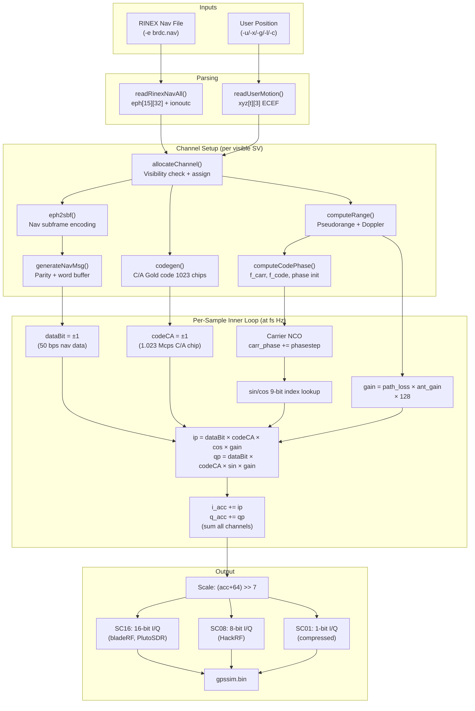

# Signal Generation Pipeline: From Input to I/Q Output

## Overview

GPS-SDR-SIM transforms two inputs — a user position trajectory and broadcast ephemeris data — into a digitized GPS L1 C/A baseband signal file (interleaved I/Q samples). The output can be played back through an SDR to simulate a GPS constellation for a receiver under test.

This document traces the complete pipeline from input parsing through per-channel signal synthesis to the final binary output.

## High-Level Pipeline

```
┌──────────────┐   ┌──────────────────┐   ┌──────────────────┐   ┌──────────────┐
│ User Position│   │ RINEX Ephemeris   │   │ Channel Alloc.   │   │ I/Q Output   │
│  (CSV/NMEA/  │──▶│ + Iono/UTC Parse  │──▶│ + Per-Channel    │──▶│ File Write   │
│  static LLH) │   │ readRinexNavAll() │   │   Signal Gen     │   │ (bin format) │
└──────────────┘   └──────────────────┘   └──────────────────┘   └──────────────┘
```

### Stage 1 — Input Parsing

| Input Type          | Option | Reader Function        | Output                                          |
| ------------------- | ------ | ---------------------- | ----------------------------------------------- |
| ECEF trajectory CSV | `-u`   | `readUserMotion()`     | `xyz[t][3]` — ECEF positions at 10 Hz           |
| LLH trajectory CSV  | `-x`   | `readUserMotionLLH()`  | `xyz[t][3]` — converted to ECEF via `llh2xyz()` |
| NMEA GGA stream     | `-g`   | `readNmeaGGA()`        | `xyz[t][3]` — parsed and converted to ECEF      |
| Static ECEF         | `-c`   | Direct `sscanf`        | `xyz[0][3]` — single position                   |
| Static Lat/Lon/Hgt  | `-l`   | `sscanf` + `llh2xyz()` | `xyz[0][3]` — single position                   |

The RINEX navigation file (`-e`) is parsed by `readRinexNavAll()` into:

- `ephem_t eph[EPHEM_ARRAY_SIZE][MAX_SAT]` — up to 15 sets of ephemerides for 32 SVs
- `ionoutc_t` — Klobuchar ionospheric correction and UTC/leap-second parameters

### Stage 2 — Geometry and Range Computation

Every **0.1 seconds** (10 Hz) of simulated time, for each active channel:

1. **Satellite position/velocity**: `satpos()` propagates the broadcast ephemeris using Kepler's equation (iterative eccentric anomaly) to get SV ECEF position, velocity, and clock correction.

2. **Pseudorange**: `computeRange()` computes:
   - Line-of-sight vector and light-time delay
   - Earth rotation correction (Sagnac effect)
   - Geometric range `rho.d`
   - Pseudorange `rho.range = geometric_range - c × clock_correction + iono_delay`
   - Range rate `rho.rate` (from velocity dot LOS)
   - Azimuth/elevation angles

3. **Ionospheric delay**: `ionosphericDelay()` applies the Klobuchar model using α/β coefficients from the RINEX header.

### Stage 3 — Channel Allocation

`allocateChannel()` determines which satellites get simulated (see [satellite-selection.md](satellite-selection.md) for details). When a satellite is newly allocated:

1. **C/A code generation** — `codegen()` produces the 1023-chip Gold code sequence for the PRN
2. **Subframe encoding** — `eph2sbf()` packs ephemeris parameters into the 5 GPS subframe bit structures
3. **Navigation message** — `generateNavMsg()` computes parity (Hamming) and assembles the 30-second word buffer `dwrd[]`
4. **Initial range** — `computeRange()` sets the initial pseudorange and carrier phase

### Stage 4 — Per-Channel Signal Model (The Core)

Each channel synthesizes one satellite's contribution. The signal model is:

```
s_ch(t) = A × D(t) × C(t) × carrier(t)
```

Where:

- **A** = amplitude (path loss × antenna gain)
- **D(t)** = navigation data bit (±1, 50 bps)
- **C(t)** = C/A code chip (±1, 1.023 Mcps)
- **carrier(t)** = cos/sin of accumulated carrier phase

#### 4.1 Doppler → Frequency Offsets

From `computeCodePhase()`, the pseudorange rate translates to frequency offsets:

```c
// Carrier Doppler from range rate
f_carr = -rhorate / LAMBDA_L1;          // Hz

// Code Doppler (carrier-aided)
f_code = CODE_FREQ + f_carr * CARR_TO_CODE;  // CARR_TO_CODE = 1/1540
```

The carrier-to-code ratio (1540) comes from L1 carrier frequency (1575.42 MHz) divided by C/A code rate (1.023 MHz).

#### 4.2 Code Phase Tracking

`computeCodePhase()` initializes the code timing from the pseudorange:

```c
ms = ((time_since_epoch + 6.0) - pseudorange/c) × 1000.0  // milliseconds

code_phase = fractional_ms × 1023     // chip within current code period
iword = ms / 600                       // which 30-bit word (600 ms/word)
ibit  = (ms % 600) / 20               // which bit within word (20 ms/bit)
icode = (ms % 20)                      // which code period within bit
```

Each output sample advances the code phase by:

```
code_phase += f_code × delt    (where delt = 1/samp_freq)
```

#### 4.3 Navigation Data Bit Timing

The GPS timing hierarchy within each channel:

| Level                   | Duration | Count per parent | Channel field    |
| ----------------------- | -------- | ---------------- | ---------------- |
| C/A code period         | 1 ms     | 20 per bit       | `icode` (0–19)   |
| Navigation data bit     | 20 ms    | 30 per word      | `ibit` (0–29)    |
| Word (30 bits + parity) | 600 ms   | 10 per subframe  | `iword` (0–59)   |
| Subframe                | 6 sec    | 5 per frame      | via `sbf[5][10]` |
| Frame                   | 30 sec   | —                | refresh cycle    |

The current data bit is extracted from the word buffer:

```c
dataBit = ((dwrd[iword] >> (29 - ibit)) & 0x1) * 2 - 1;  // map 0/1 → ±1
```

#### 4.4 Carrier Phase NCO (Fixed-Point)

By default (`FLOAT_CARR_PHASE` not defined), the carrier uses a 32-bit fixed-point phase accumulator:

```c
// Setup (every 0.1s epoch):
carr_phasestep = (int)round(512.0 * 65536.0 * f_carr * delt);
// = round(2^25 × f_carr / samp_freq)

// Per sample:
carr_phase += carr_phasestep;   // wraps naturally at 2^32

// Table index (9-bit, for 512-entry table):
iTable = (carr_phase >> 16) & 0x1ff;
```

The 512-entry `sinTable512[]` and `cosTable512[]` provide ±250 scaled values, avoiding per-sample `sin()`/`cos()` calls.

With `FLOAT_CARR_PHASE` defined, a double-precision phase (0.0–1.0) is used instead — smoother but slower.

#### 4.5 Amplitude: Path Loss and Antenna Gain

```c
// Path loss (free-space, relative to nominal 20,200 km orbit)
path_loss = 20200000.0 / rho.d;

// Receiver antenna gain from elevation-indexed pattern
ibs = (int)((90.0 - elevation_deg) / 5.0);  // boresight angle index
ant_gain = ant_pat[ibs];                      // linear scale (from dB table)

// Combined gain per channel (scaled by 2^7 = 128)
gain[i] = (int)(path_loss * ant_gain * 128.0);
```

When `-p` is used, path loss is disabled and gain is held at a fixed value (default 128).

### Stage 5 — Sample Accumulation (The Inner Loop)

For each 0.1-second block (`iq_buff_size` samples):

```c
for (isamp = 0; isamp < iq_buff_size; isamp++) {
    int i_acc = 0, q_acc = 0;

    for (i = 0; i < MAX_CHAN; i++) {
        if (chan[i].prn > 0) {
            // Carrier lookup
            iTable = (carr_phase >> 16) & 0x1ff;

            // I/Q = dataBit × codeCA × carrier × gain
            ip = dataBit * codeCA * cosTable512[iTable] * gain[i];
            qp = dataBit * codeCA * sinTable512[iTable] * gain[i];

            i_acc += ip;
            q_acc += qp;

            // Advance code phase
            code_phase += f_code * delt;
            // Handle code period rollover → bit → word transitions

            // Advance carrier phase
            carr_phase += carr_phasestep;
        }
    }

    // Scale down (remove gain factor of 2^7)
    i_acc = (i_acc + 64) >> 7;
    q_acc = (q_acc + 64) >> 7;

    iq_buff[isamp*2]   = (short)i_acc;
    iq_buff[isamp*2+1] = (short)q_acc;
}
```

All active channels are summed coherently — phase relationships between satellites are preserved, creating realistic multi-satellite interference.

### Stage 6 — Output Formatting

The accumulated I/Q buffer is written in one of three formats:

| Format | Option            | Sample storage                                          | Bytes per complex sample |
| ------ | ----------------- | ------------------------------------------------------- | ------------------------ |
| SC16   | `-b 16` (default) | Signed 16-bit I, signed 16-bit Q                        | 4                        |
| SC08   | `-b 8`            | Signed 8-bit I, signed 8-bit Q (right-shifted by 4)     | 2                        |
| SC01   | `-b 1`            | 1-bit I, 1-bit Q (sign only), 4 samples packed per byte | 0.25                     |

**SC16**: Direct `fwrite` of the `short` buffer — native for bladeRF and PlutoSDR.

**SC08**: Each 16-bit sample is right-shifted by 4 bits to fit 8-bit range — used by HackRF:

```c
iq8_buff[isamp] = iq_buff[isamp] >> 4;
```

**SC01**: Each sample reduced to its sign bit, then 8 sign bits packed per byte (MSB first):

```c
iq8_buff[isamp/8] |= (iq_buff[isamp] > 0 ? 0x01 : 0x00) << (7 - isamp%8);
```

This interleaves I and Q bits: `{I0,Q0,I1,Q1,I2,Q2,I3,Q3}` per byte.

### Stage 7 — Periodic Updates (Every 30 Seconds)

Every 30 seconds of simulated time (`igrx % 300 == 0`):

1. **Navigation message refresh** — `generateNavMsg()` updates TOW (Time of Week) in subframe words
2. **Ephemeris set update** — If a newer ephemeris set's TOC is within 1 hour, switch to it and regenerate subframes via `eph2sbf()`
3. **Channel reallocation** — `allocateChannel()` adds newly-risen satellites and removes set satellites

## Data Flow Diagram

```
RINEX Nav File ──▶ readRinexNavAll() ──▶ eph[15][32] + ionoutc
                                              │
User Position  ──▶ readUserMotion()  ──▶ xyz[t][3]
                                              │
                    ┌─────────────────────────┘
                    ▼
              allocateChannel()  ──▶ chan[16] (active channels)
                    │
          ┌─────────┼─────────────────────────────┐
          ▼         ▼                             ▼
     codegen()   eph2sbf()              computeRange()
     C/A code    Nav subframes          Pseudorange + Doppler
          │         │                             │
          ▼         ▼                             ▼
     ┌────────────────────────────────────────────────┐
     │           Per-Sample Inner Loop                │
     │                                                │
     │  For each sample at rate fs:                   │
     │    For each channel:                           │
     │      dataBit × codeCA × carrier_LUT × gain    │
     │      accumulate I and Q                        │
     │    Write I/Q sample to buffer                  │
     └────────────────────────────────────────────────┘
                    │
                    ▼
              Output File (gpssim.bin)
              Format: SC01 / SC08 / SC16
```



## Key Constants

| Constant         | Value         | Description                         |
| ---------------- | ------------- | ----------------------------------- |
| `CARR_FREQ`      | 1575.42 MHz   | GPS L1 carrier frequency            |
| `CODE_FREQ`      | 1.023 MHz     | C/A code chipping rate              |
| `CARR_TO_CODE`   | 1/1540        | Carrier-to-code frequency ratio     |
| `CA_SEQ_LEN`     | 1023          | C/A code chips per period (1 ms)    |
| `LAMBDA_L1`      | 0.1903 m      | L1 wavelength                       |
| `SPEED_OF_LIGHT` | 2.998×10⁸ m/s | Speed of light                      |
| `MAX_CHAN`       | 16            | Max simultaneous satellite channels |
| `MAX_SAT`        | 32            | Max GPS PRN numbers                 |
| `N_SBF`          | 5             | Subframes per frame                 |
| `N_DWRD_SBF`     | 10            | Words per subframe                  |

## Source References

| Function               | File            | Purpose                                           |
| ---------------------- | --------------- | ------------------------------------------------- |
| `main()`               | `gpssim.c:1731` | Entry point, option parsing, main simulation loop |
| `readRinexNavAll()`    | `gpssim.c:828`  | Parse RINEX navigation file                       |
| `satpos()`             | `gpssim.c:381`  | Compute SV position/velocity from ephemeris       |
| `computeRange()`       | `gpssim.c:1265` | Pseudorange, range rate, az/el, iono delay        |
| `computeCodePhase()`   | `gpssim.c:1329` | Code/carrier frequency offsets and initial phase  |
| `allocateChannel()`    | `gpssim.c:1627` | Visibility-based channel assignment               |
| `codegen()`            | `gpssim.c:134`  | C/A Gold code generation                          |
| `eph2sbf()`            | `gpssim.c:492`  | Ephemeris → navigation subframe encoding          |
| `generateNavMsg()`     | `gpssim.c:1522` | Subframe word assembly with parity                |
| `ionosphericDelay()`   | `gpssim.c:1182` | Klobuchar ionospheric delay model                 |
| `checkSatVisibility()` | `gpssim.c:1604` | Elevation-based visibility check                  |
