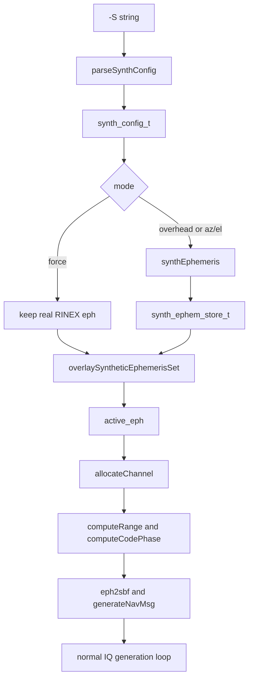

# Synthetic Satellites: Implementation Details

This document explains the implementation of the `-S` feature in `gpssim.c` at code level.

The goal of `-S` is not to generate a special-case fake waveform. The goal is to make a synthetic PRN look like a normal satellite to the rest of the simulator by supplying a valid `ephem_t` and then reusing the existing GPS signal pipeline.

That design choice is the reason the feature works.

## Design Summary

The feature has two modes:

1. `PRN:force`
2. `PRN:overhead` or `PRN:az/el`

They solve different problems.

### `force`

`force` does not invent a new orbit. It keeps the real broadcast ephemeris from the RINEX file and only bypasses the visibility filter so a below-horizon satellite can still be allocated to a channel.

### `overhead` and `az/el`

These modes synthesize a fresh `ephem_t` that represents a circular GPS-like orbit whose position matches the requested sky location at the scenario start.

That synthetic ephemeris is overlaid onto the currently selected RINEX set and then used by the normal pipeline exactly like a real satellite ephemeris.

## The Core Idea

The implementation works because the synthetic feature stops at the ephemeris layer.

It does **not** add a special “synthetic sample generator” downstream. Instead, it makes sure the normal functions all receive a consistent `ephem_t`:

- `satpos()` propagates it
- `computeRange()` derives pseudorange and Doppler from it
- `eph2sbf()` encodes it into GPS subframes
- `generateNavMsg()` turns those subframes into a valid nav bit stream
- the I/Q loop modulates the nav bits and C/A code in the usual way

So once a synthetic PRN reaches `active_eph[]`, the rest of the program no longer cares whether that PRN came from RINEX or from the synthetic generator.

## Data Structures

The feature is built around two small structures in `gpssim.h`:

```c
typedef struct {
    synth_mode_t mode[MAX_SAT];
    double azimuth[MAX_SAT];
    double elevation[MAX_SAT];
    int enabled;
} synth_config_t;

typedef struct {
    int valid[MAX_SAT];
    ephem_t eph[MAX_SAT];
} synth_ephem_store_t;
```

`synth_config_t` stores the user request from `-S`.

`synth_ephem_store_t` stores synthesized ephemerides separately from the parsed RINEX sets. That separation is important because the code may switch hourly ephemeris sets during a long run and must be able to re-apply the synthetic satellites after each refresh.

## End-To-End Flow



## Step 1: Parse `-S`

`main()` calls `parseSynthConfig()` when it sees `-S`:

```c
if (parseSynthConfig(&synth_cfg, optarg) == FALSE) {
    fprintf(stderr,
            "ERROR: Invalid synthetic spec. Use PRN:force, PRN:overhead, "
            "or PRN:az/el\n");
    exit(1);
}
```

`parseSynthConfig()` accepts comma-separated `PRN:mode` entries.

The parser does four things:

1. validates the PRN number
2. identifies the mode
3. converts azimuth/elevation to radians for `az/el`
4. sets `cfg->enabled = TRUE`

Relevant behavior:

- `force` sets `cfg->mode[prn - 1] = SYNTH_FORCE`
- `overhead` sets `cfg->mode[prn - 1] = SYNTH_OVERHEAD`
- `az/el` sets `cfg->mode[prn - 1] = SYNTH_AZEL` plus `azimuth[]` and `elevation[]`

It also constrains inputs:

- azimuth must be in `[0, 360)` degrees
- elevation must be in `[-5, 90]` degrees

That keeps the later geometry math simple and predictable.

## Step 2: Select The Active Real Ephemeris Set

Before synthetic satellites are built, `main()` selects the current RINEX set.

That matters because:

- `force` needs a real ephemeris to exist for that PRN
- the simulator needs a baseline real ephemeris array that synthetic PRNs can overlay onto

The helper functions involved are:

- `getSetReferenceToc()`
- `shouldAdvanceEphSet()`

They choose the hourly ephemeris set whose time is appropriate for the current scenario start time.

## Step 3: Build Synthetic Ephemerides At Setup Time

After selecting the active RINEX set, `main()` builds synthetic satellites:

```c
if (synth_cfg.enabled) {
    gpstime_t synth_ref;
    synth_ref = g0;
    synth_ref.sec = floor(synth_ref.sec / 16.0) * 16.0;
    ...
}
```

The alignment to 16 seconds is intentional. GPS broadcast ephemeris fields such as `TOE` and `TOC` are encoded at 16-second resolution, so the synthetic ephemeris is snapped onto the same grid.

This makes the resulting nav message look like a normal broadcast-style message instead of an arbitrary internal-only state.

## Step 4: `force` Mode

For `SYNTH_FORCE`, the code does not call `synthEphemeris()`.

It only checks whether the chosen RINEX set already contains a valid ephemeris for the requested PRN:

```c
if (eph[ieph][sv].vflg != 1) {
    fprintf(stderr,
            "WARNING: PRN %d forced but has no ephemeris in RINEX. "
            "Skipping.\n",
            sv + 1);
    synth_cfg.mode[sv] = SYNTH_NONE;
}
```

So `force` is really a **visibility override**, not an orbit synthesizer.

Why it works:

- the PRN already has a real orbit
- `satpos()` and `computeRange()` already know how to propagate it
- the only reason it would normally be absent is that the visibility gate rejects it

Once the visibility gate is bypassed, the waveform is still based on real orbital geometry.

## Step 5: `overhead` and `az/el` Modes

For `SYNTH_OVERHEAD` and `SYNTH_AZEL`, the code chooses a target azimuth/elevation:

```c
if (synth_cfg.mode[sv] == SYNTH_OVERHEAD) {
    az = 0.0;
    el = PI / 2.0;
} else {
    az = synth_cfg.azimuth[sv];
    el = synth_cfg.elevation[sv];
}
```

Then it calls:

```c
synthEphemeris(&synth_eph.eph[sv], xyz[0], az, el, synth_ref, synth_ref);
synth_eph.valid[sv] = TRUE;
```

Notice the use of `xyz[0]`, the initial receiver position.

That means the requested sky location is exact at scenario start. After that, the synthetic satellite evolves like a normal orbit and may drift slightly in az/el, especially for long durations or moving receivers.

## Step 6: Convert Az/El Into A Satellite ECEF Position

The first half of synthesis happens in `azel2satpos()`.

### 6.1 Build A Local NEU Direction

The code converts the requested azimuth/elevation into a North-East-Up unit vector:

```c
neu[0] = cos(el) * cos(az);
neu[1] = cos(el) * sin(az);
neu[2] = sin(el);
```

That gives a direction in the receiver's local tangent frame.

### 6.2 Rotate NEU Into ECEF

The receiver's geodetic location is computed with `xyz2llh()`, then `ltcmat()` builds the local tangent transform.

Because `ltcmat()` is orthogonal, its transpose converts NEU back into ECEF direction cosines.

### 6.3 Intersect The Ray With The GPS Orbit Sphere

The code then solves for the slant range from the receiver to a point on the sphere of radius `GPS_ORBIT_RADIUS`.

The equation used is the geometric intersection of:

- a ray starting at the receiver and pointing along the requested sky direction
- a sphere centered at Earth center with GPS orbital radius

The implemented closed-form solution is:

```c
slant = -r_rx * sin(el) + sqrt(disc);
```

where:

```c
disc = GPS_ORBIT_RADIUS * GPS_ORBIT_RADIUS -
       r_rx * r_rx * cos(el) * cos(el);
```

If the discriminant is negative, the requested ray misses the orbit sphere. In that case the code falls back to a zenith-like placement.

This step produces an actual ECEF satellite position `sat_ecef[]` at GPS orbital altitude.

## Step 7: Convert ECEF Position Back Into Orbital Elements

This is the most important part of the feature.

The normal simulator does not operate from a target ECEF position directly. It operates from a broadcast-style ephemeris, and `satpos()` later reconstructs position from that ephemeris.

So `synthEphemeris()` must do the inverse job: given a desired satellite ECEF position, find ephemeris values that make `satpos()` reproduce that position.

### 7.1 Simplify The Orbit Model

The code chooses a circular GPS-like orbit:

- `ecc = 0.0`
- `aop = 0.0`
- all harmonic corrections = `0.0`
- inclination = `GPS_INCLINATION`

That greatly simplifies the inverse problem.

At `t = toe`, the orbital plane equations reduce to:

```text
pos[0] = xpk * cos(ok) - ypk * cos(inc0) * sin(ok)
pos[1] = xpk * sin(ok) + ypk * cos(inc0) * cos(ok)
pos[2] = ypk * sin(inc0)
```

with:

```text
xpk = A * cos(uk)
ypk = A * sin(uk)
```

### 7.2 Recover `ypk` From Z

Since:

```text
Z = ypk * sin(inc0)
```

the code recovers:

```c
ypk = sat_ecef[2] / sin(GPS_INCLINATION);
```

### 7.3 Clamp To The Reachable Inclination Band

GPS satellites are limited by their inclination. If the user asks for something physically outside that inclination band, `ypk` would exceed the orbital radius.

So the code clamps:

```c
double max_ypk = GPS_ORBIT_RADIUS * 0.9999;
```

This is why very high latitude “overhead” requests may produce a warning and a best-effort lower elevation instead of the exact requested zenith placement.

### 7.4 Recover `xpk` And Its Sign

The magnitude comes from the orbit radius:

```c
xpk = sqrt(GPS_ORBIT_RADIUS * GPS_ORBIT_RADIUS - ypk * ypk);
```

The sign is then chosen so the reconstructed X/Y position lands in the correct branch of the orbit plane.

### 7.5 Recover Argument Of Latitude And Node Angle

The argument of latitude is:

```c
uk = atan2(ypk, xpk);
```

Then `ok` is solved from the X/Y equations:

```c
ok = atan2(sat_ecef[1] * xpk - sat_ecef[0] * ypk_ci,
           sat_ecef[0] * xpk + sat_ecef[1] * ypk_ci);
```

### 7.6 Populate A Valid `ephem_t`

Once the inverse geometry is solved, the synthetic ephemeris is filled in:

```c
eph->vflg = 1;
eph->toe = toe;
eph->toc = toc;
eph->sqrta = sqrt(GPS_ORBIT_RADIUS);
eph->ecc = 0.0;
eph->inc0 = GPS_INCLINATION;
eph->m0 = wrapToPi(uk);
eph->aop = 0.0;
eph->omg0 = wrapToPi(ok + OMEGA_EARTH * toe.sec);
eph->omgdot = -8.0e-9;
eph->idot = 0.0;
eph->deltan = 0.0;
```

The term:

```c
eph->omg0 = wrapToPi(ok + OMEGA_EARTH * toe.sec);
```

is especially important. `satpos()` later subtracts Earth rotation with:

```c
ok = eph.omg0 + tk * eph.omgkdot - OMEGA_EARTH * eph.toe.sec;
```

So synthesis must pre-compensate for that Earth-rotation term. That is why the synthetic satellite appears at the requested ECEF sky location when the orbit is propagated back through `satpos()`.

### 7.7 Populate Working Variables

The function also fills the post-parsing helper fields exactly like `readRinexNavAll()` does for real ephemerides:

```c
eph->A = eph->sqrta * eph->sqrta;
eph->n = sqrt(GM_EARTH / (eph->A * eph->A * eph->A)) + eph->deltan;
eph->sq1e2 = 1.0;
eph->omgkdot = eph->omgdot - OMEGA_EARTH;
```

Without those fields, downstream propagation would be inconsistent with the rest of the codebase.

## Step 8: Overlay Synthetic PRNs Onto The Active Set

The overlay step is intentionally simple:

```c
memcpy(dst, real_set, sizeof(ephem_t) * MAX_SAT);

for (sv = 0; sv < MAX_SAT; sv++) {
    if ((cfg->mode[sv] == SYNTH_OVERHEAD || cfg->mode[sv] == SYNTH_AZEL) &&
        store->valid[sv] == TRUE)
        dst[sv] = store->eph[sv];
}
```

This produces a unified `active_eph[]` array.

Important behavior:

- normal PRNs keep real RINEX ephemeris
- `force` PRNs also keep real RINEX ephemeris
- `overhead` and `az/el` PRNs replace the real entry with a synthetic `ephem_t`

That means all later code reads one array and does not need to know the source of any given PRN.

## Step 9: Bypass The Visibility Gate In `allocateChannel()`

The only place where synthetic satellites need special logic after overlay is channel allocation.

Normally a satellite is allocated only if `checkSatVisibility()` says it is above the mask.

For synthetic or forced PRNs, the code does this instead:

```c
if (scfg->enabled && scfg->mode[sv] != SYNTH_NONE) {
    if (eph[sv].vflg != 1) {
        vis = -1;
    } else {
        checkSatVisibility(eph[sv], grx, xyz, -90.0, azel);
        vis = 1;
    }
}
```

Two details matter here.

### It Still Computes `azel`

The call to `checkSatVisibility()` is still made, but with an elevation mask of `-90.0` degrees.

So the code still gets meaningful azimuth/elevation output for logging and channel initialization.

### It Forces Visibility

It then sets `vis = 1`, so allocation proceeds even if the synthetic or forced satellite would fail the normal horizon test.

From there, allocation is unchanged:

- `codegen()` creates the PRN C/A code
- `eph2sbf()` builds the navigation subframes
- `generateNavMsg()` creates nav words
- `computeRange()` initializes the first pseudorange

That is the second key reason the feature works: once admitted through allocation, the synthetic PRN becomes a normal channel.

## Step 10: Why Receivers Can Track It

The signal can work on a real receiver because the waveform is internally consistent in three ways.

### 10.1 Code, Doppler, And Geometry Come From The Same Ephemeris

The same `active_eph[sv]` is used by:

- `satpos()` for satellite position
- `computeRange()` for pseudorange and range rate
- `computeCodePhase()` for code and carrier frequency

So the receiver sees a PRN with self-consistent code phase and Doppler.

### 10.2 The Navigation Message Tells The Same Story

The same `ephem_t` is also passed through:

- `eph2sbf()`
- `generateNavMsg()`

So if the receiver decodes subframes 1 to 3, it recovers orbital parameters consistent with the signal geometry it observed during tracking.

That is much stronger than simply injecting a PRN code with arbitrary Doppler.

### 10.3 The Sample Loop Is Standard GPS-Like Modulation

Once the channel is initialized, the I/Q generator does the normal operation:

```c
ip = chan[i].dataBit * chan[i].codeCA * cosTable512[iTable] * gain[i];
qp = chan[i].dataBit * chan[i].codeCA * sinTable512[iTable] * gain[i];
```

Then it advances:

- carrier phase
- C/A code phase
- nav bit timing

So the RF scene contains a standard-looking L1 C/A waveform. Nothing in the final waveform marks it as synthetic.

## Step 11: Why Long Runs Still Work

The code refreshes ephemeris sets during long runs. To keep synthetic PRNs alive across those refreshes, `main()` calls `overlaySyntheticEphemerisSet()` again when the active real set advances.

Then it regenerates subframes for allocated channels:

```c
eph2sbf(active_eph[chan[i].prn - 1], ionoutc, chan[i].sbf);
```

So the synthetic orbit remains stable across the hourly RINEX-set change.

This is why the feature is implemented with a separate `synth_ephem_store_t` instead of mutating the parsed RINEX arrays directly.

## Step 12: Important Limitations

The feature is effective, but it is not pretending to be a full constellation design tool.

### The orbit model is simplified

Synthetic satellites use:

- circular orbit
- zero eccentricity
- zero harmonic corrections
- zero satellite clock bias and drift

That is good enough for waveform consistency and for controlled receiver testing, but it is not intended to mimic every detail of a real GPS broadcast orbit.

### The target sky position is exact only at scenario start

The synthetic orbit is synthesized from `xyz[0]`, not continuously re-solved as the receiver moves.

So:

- short static scenarios match very closely
- long or dynamic scenarios will drift from the originally requested az/el

### `force` requires RINEX support

If a PRN has no valid ephemeris in the current RINEX set, `force` cannot fabricate one. In that case it is skipped.

### Channel count is still capped

`MAX_CHAN` remains 16. Synthetic satellites compete with real satellites for those channel slots.

## Why This Design Is Good Engineering

This implementation is small because it modifies the system at the right abstraction level.

Instead of adding special-case behavior to:

- `computeRange()`
- `satpos()`
- `generateNavMsg()`
- or the sample loop

it only adds logic in two places:

1. ephemeris construction or selection
2. visibility gating during channel allocation

Everything downstream stays unchanged.

That gives three benefits:

1. synthetic PRNs inherit the same GPS signal model as real PRNs
2. the code is easier to reason about and maintain
3. receivers see a believable signal because geometry, nav data, and waveform all come from one shared source of truth

## Short Proof Of Why It Can Work

At a high level, the feature works because the following chain is consistent:

```text
requested az/el
  -> synthetic ECEF position
  -> synthetic ephemeris parameters
  -> satpos() reconstructed position
  -> computeRange() pseudorange and Doppler
  -> computeCodePhase() code/carrier timing
  -> eph2sbf() + generateNavMsg() nav bits
  -> IQ loop waveform
```

If all stages use the same ephemeris consistently, a receiver can:

- acquire the PRN
- track code and carrier
- decode navigation bits
- interpret those bits as an orbit compatible with the tracking data

That is exactly what this implementation arranges.
